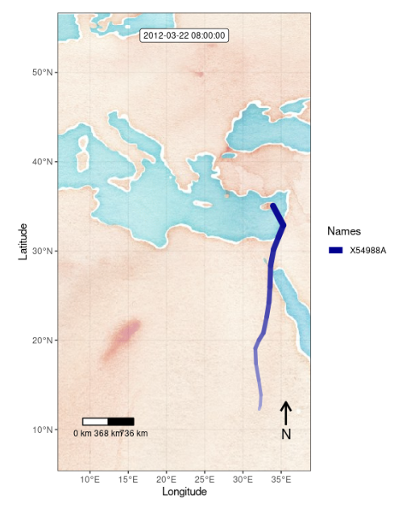
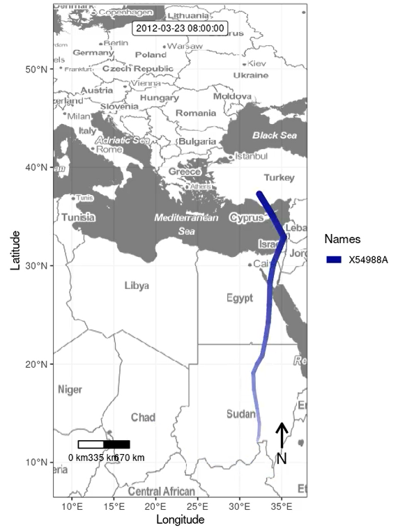
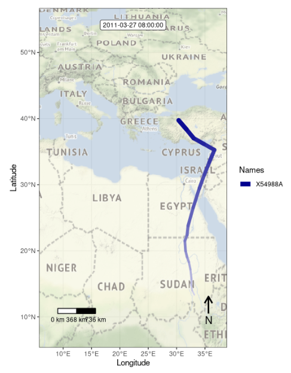
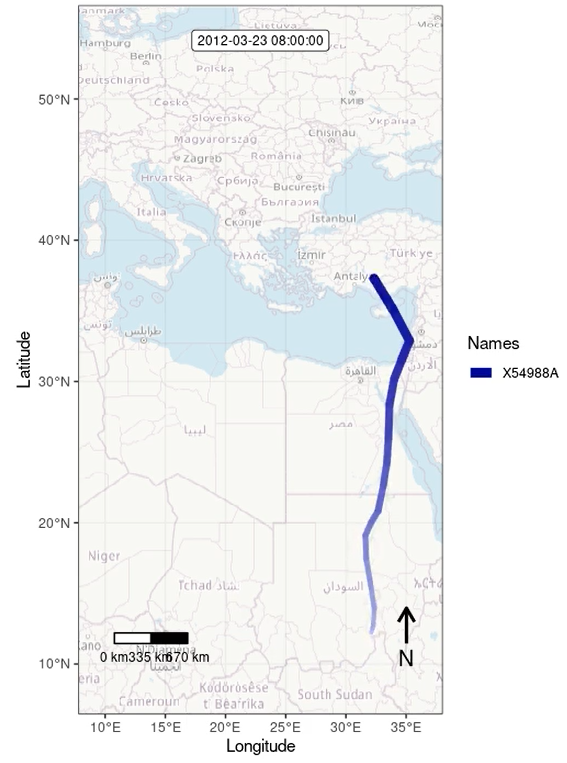

# Animation File MoveVis
MoveApps

Github repository: *github.com/movestore/animation-moveVis*

## Description
 Generate an animation of your tracks using the moveVis R package. The animation is saved as a .mp4 artefact that can be downloaded to your device. (Note: depending on the size of your data set this App may take a while to run (30+ min)) 

## Documentation
To generate an aligned animation of all tracks of the input data set, first all individual tracks are aligned by time and subsampled to a defined resolution (see parameters). Then all tracks are plotted as moving dots on a common Open Street Map. The frames of all individual tracks are finally combined and written as an animated gif file to download as MoveApps output artefact. The original data set is also passed on as output to a possible next App. 

### Input data
moveStack in Movebank format

### Output data
moveStack in Movebank format

### Artefacts
`animation.moveVis.gif`: Animated gif file showing an animation of all tracked positions aligned by time.

### Parameters 
`res`: This parameter allows the user to define the time interval by which the tracks shall be thinned to align. One numeric value has to be entered. If no value is entered, this parameter defaults to the mean resolution of the data set. See unit below. 

`uni`: Parameter to select time unit for alignment resolution. Can only be 'seconds' up to 'days'. Default is 'hours'.

`maptype`: Selection of maptype for animation background. The map will be downloaded from Open Street Map (osm). Default 'watercolor'. As the App takes rather some time to run, see below examples of the map types to help your decision.

 `mapres`: resolution of the background map. Can take values between 0 and 1. Default 0.2.
 
 `frames_per_sec`: frames to be shown per second to alter the speed of the animation. Default 25.
 
 `show_legend`: should a legend of the track IDs be shown? Default yes.

#### Watercolor

#### Topographic

#### Toner

#### Terrain

#### Streets

### Null or error handling:
**Parameter `res`:** If nothing (NULL) is entered here, a fallback default is used, namely the mean resolution of the data set. Note that only numeric values can be entered, else will lead to an error.

**Parameter `uni`:** This unit parameter is default to 'hours', which might not fit to your data set or requirements; then you have to make your selection.

**Parameter `maptype`:** Since there is a dropdown list of possible values, no error are expected.

**Data:** The full input data set is returned for further use in a next App and cannot be empty.
